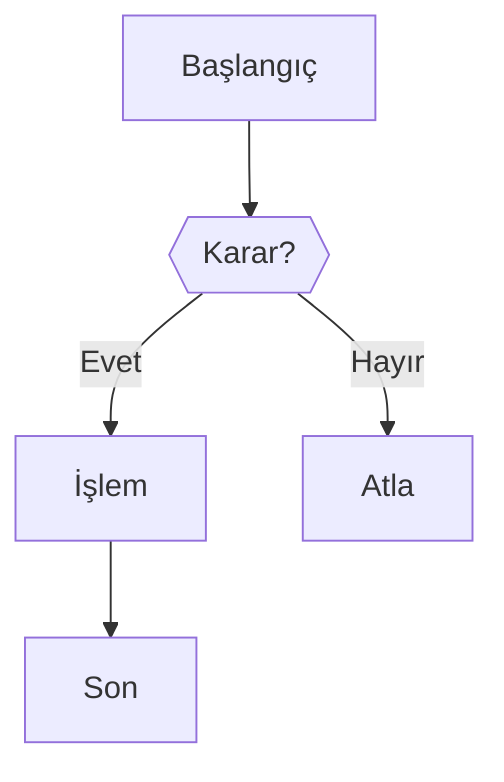
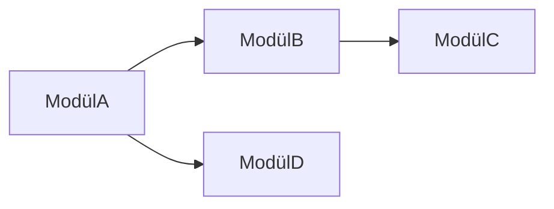

# MexCBrain — Wiki Şeması (AGENTS.md)

Bu dosya, LLM'e MexCBrain wiki'sini nasıl okuyacağını, güncelleyeceğini ve genişleteceğini açıklar.

---

## Wiki Yapısı

```
brain/wiki/
├── 00-INDEX.md          ← Ana katalog (her güncelleme sonrası güncelle)
├── 00-LOG.md            ← Append-only log (asla sil)
├── flows/               ← Sinyal akışı sayfaları (01-05)
├── entities/            ← Modül sayfaları
├── concepts/            ← Kavram açıklamaları
└── api/                 ← API ve cron dökümantasyonu
```

---

## Sayfa Formatı

Her `.md` dosyası şu YAML frontmatter ile başlar:

```yaml
---
title: "Sayfa Başlığı"
tags: [tag1, tag2]
sourceFile: src/lib/ornek.ts     # veya sourceFiles: [...]
lastUpdated: YYYY-MM-DD
type: flow | entity | concept | api | index
---
```

---

## Linkleme Kuralları

- Sayfalar arası linkler `[[sayfa-adı|Görünen Ad]]` formatında
- Kod referansları `` `src/lib/dosya.ts` `` formatında
- Mermaid diyagramlar her akış sayfasında zorunlu

---

## Yeni Dosya Ekleme — Ingest Workflow

Projeye yeni bir `src/lib/*.ts` dosyası eklendiğinde:

1. **Eğer önemli bir modül ise:** `entities/` altına sayfa ekle
2. **`00-INDEX.md`** Entity Sayfaları tablosunu güncelle
3. **`00-LOG.md`** başına yeni entry ekle (format aşağıda)
4. **İlgili akış sayfalarına** link ekle
5. **İlgili kavramlara** bağlantı ekle

---

## Log Entry Formatı

```markdown
## [YYYY-MM-DD] ingest | Değişiklik Başlığı

- **İşlem:** Yeni dosya / Güncelleme / Lint
- **Kapsam:** Hangi sayfalar etkilendi
- **Kaynak:** src/lib/xxx.ts
- **Notlar:** Önemli değişiklikler
```

---

## Lint Kuralları (Periyodik Bakım)

LLM'in `npm run wiki:lint` ile kontrol ettiği şeyler:

- [ ] Tüm `[[link]]` hedefleri var mı?
- [ ] Orphan sayfalar var mı? (gelen link yok)
- [ ] `00-INDEX.md` tüm entity sayfalarını içeriyor mu?
- [ ] `lastUpdated` tarihi güncel mi?
- [ ] Yeni src dosyaları wiki'ye eklendi mi?

---

## Mermaid Diyagram Şablonları

### Akış Diyagramı (flowchart)



### Bağımlılık Diyagramı (graph)



---

## Önemli Bağımlılık Zinciri (Başvuru)

```
SignalScanner
    ↓ kullanır
MatrixV5Strategy
    ↓ içinde
MatrixV5Engine → signal-arbitration (SAE)
    ↓
PilotExecutor.handleSignal()
    ↓ çağırır
handleSmartTrade() → SmartTrade
    ↓ DB
orders tablosu (status: PENDING/FILLED)
    ↓ izler
SmartTradeMonitor (1s döngü)
    ↓ tetikler
SmartTradeExecution.executeExit()
    ↓ kaydeder
trade_history tablosu + registerPilotReEntry()
    ↓ döngü
PilotExecutor.executeReEntryBuy()
```

---

## wiki-gen.ts Kullanımı

```bash
# Tüm wiki'yi sıfırdan yenile
npm run wiki:build

# Dosya değişikliklerini izle, otomatik güncelle
npm run wiki:watch

# Sadece index ve log güncelle
npm run wiki:sync

# Wiki sağlık kontrolü
npm run wiki:lint
```
