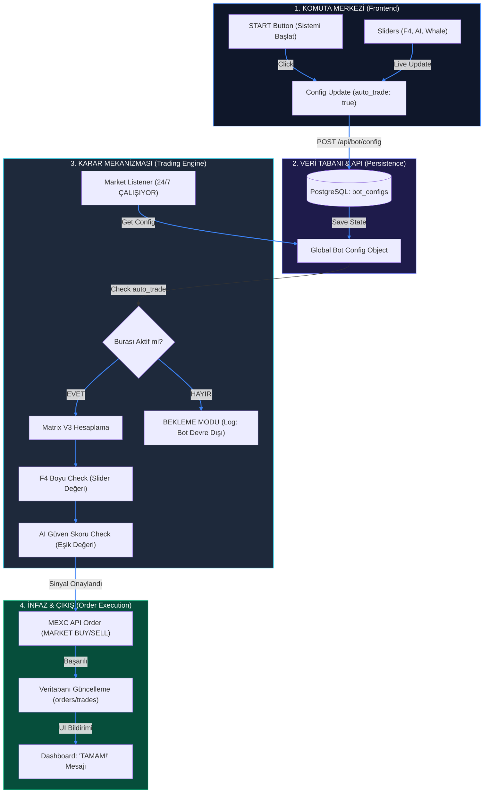

# MATRIX BOT OPERASYON HATTI (PIPELINE)

Aşağıdaki şemada, KOMUTA PANELİ üzerinden "SİSTEMİ BAŞLAT" tuşuna bastığınızda başlayan ve bir alım-satım işlemiyle sonuçlanan akıllı süreç görselleştirilmiştir.

### Varlık Bazlı İşlem Gereksinimleri:

Herhangi bir varlık (BTC, ETH, vb.) üzerinde işlem yapabilmek için teknik olarak şunlar gereklidir:

| Gereksinim        | ALIM (BUY) İçin                                 | SATIM (SELL) İçin                                   |
| :---------------- | :---------------------------------------------- | :-------------------------------------------------- |
| **Bakiye**        | Cüzdanda yeterli **USDT** olmalı.               | Cüzdanda satılacak **Varlık** (örn: BTC) olmalı.    |
| **Minimum Tutar** | En az **5 USDT** değerinde alım yapılmalı.      | En az **5 USDT** değerinde varlık satılmalı.        |
| **Hassasiyet**    | Fiyat küsuratı (Price Precision) uyumlu olmalı. | Miktar küsuratı (Lot Size Precision) uyumlu olmalı. |
| **Bot Durumu**    | `auto_trade` AÇIK veya Manuel tetikleme.        | `auto_trade` AÇIK veya Manuel/Panic tetikleme.      |
| **İşlem Çifti**   | Parite MEXC'de listeli olmalı (örn: BTCUSDT).   | Parite MEXC'de listeli olmalı.                      |

### Çoklu Varlık (Sepet) Desteği:

"Sepetimdeki her asset için ayrı işlem yapacak mı?" sorusunun cevabı: **EVET.**

Botun mimarisi "Multi-Instance" (Çoklu Örneklem) mantığıyla çalışır:

1.  **Bağımsız Karar**: Her varlık (BTC, ETH, SOL vb.) kendi özel sinyalini takip eder. BTC için "AL" sinyali geldiğinde sadece BTC alınır; bu durum ETH pozisyonunuzu etkilemez.
2.  **İzole PnL**: Her varlığın kar/zarar hesabı ve işlem geçmişi (`trade_history`) ayrı tutulur. Dashboard üzerindeki "Taktiksel Birimler" bölümünde her birini ayrı bir "Unit" olarak canlı izleyebilirsiniz.
3.  **Merkezi Denetim**: "Sistemi Başlat" (Auto-Pilot) butonu tüm sepetiniz için genel bir şalter görevi görür. Şalter kapalıyken hiçbir varlık için yeni işlem açılmaz.
4.  **Hız**: Webhook veya Tarama motoru üzerinden gelen sinyaller milisaniyeler içinde sıraya alınır ve her varlık için borsa emirleri birbirinden bağımsız olarak gönderilir.

### Zaman Dilimi (Timeframe) Kontrolü:

Botun hangi zaman diliminde işlem yapacağı, sinyalin nereden geldiğine bağlıdır:

1.  **Dahili Strateji Motoru**: Botun kendi içindeki stratejiler (Matrix V3, RSI, MACD) şu an varsayılan olarak **1 Saatlik (1h)** grafiklere göre hesaplama yapar.
2.  **TradingView Webhook**: Eğer sinyaller TradingView üzerinden geliyorsa, alarmı kurduğunuz grafiğin zaman dilimi (örn: 5dk, 15dk, 4s) neyse bot o hıza göre işlem açar.
3.  **Hız Ayarı**: Dashboard üzerindeki "Preset" (Scalp, Swing, Sniper) butonları stratejinin hassasiyetini değiştirir ama ana zaman dilimini (1h) sabit tutar.

> [!IMPORTANT]
> Bot her zaman diliminde çalışabilir. Ancak Matrix V3'ün en kararlı çalıştığı ve "Balina" hareketlerini en net yakaladığı aralık **1 Saatlik (1h)** periyottur.
