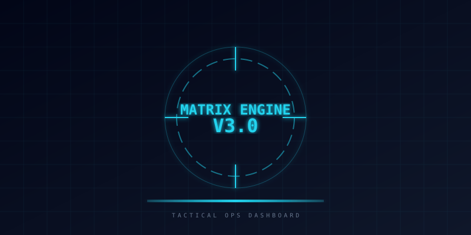

# 🤖 MexC Ultimate Trading Bot & Portfolio Matrix V3

<p align="center">
  
</p>


An elite, high-performance automated trading dashboard and portfolio management system. Leveraging the **Matrix V3 Engine**, this system provides institutional-grade market analysis, whale tracking, and AI-driven decision making for MEXC traders.

---

## ⚡ Matrix V3 Core Architecture

The heartbeat of the system is the **MTF (Multi-Timeframe) Linear Trend Engine**, derived from advanced Pine Script v6 logic and ported to TypeScript for real-time execution.

```text
┌─────────────────────────────────────────┐
│         META EXECUTION GATE             │  ← Final Decision Logic
├─────────────────────────────────────────┤
│  Whale Engine │ AI Score │ F4 Momentum  │  ← Analysis Layers
├─────────────────────────────────────────┤
│  MTF Consens │ Regime Pred │ Volatility │  ← Engineering Modules
├─────────────────────────────────────────┤
│         MEXC WEBSOCKET / API            │  ← Core Data Stream
└─────────────────────────────────────────┘
```

### 🧠 Key Engineering Modules

<table width="100%">
  <tr>
    <td width="70%">
      <ul>
        <li><strong>🐋 Whale Master Engine</strong>: Real-time detection of institutional volume spikes (2.5x - 5.0x average) to filter fake breakouts.</li>
        <li><strong>🧠 AI Confidence Score (0-100)</strong>: 10-component weighted algorithm analyzing trend, momentum, regime, and volume.</li>
        <li><strong>🌍 Market Regime Classifier</strong>: Identifies macro environments (Risk-ON / Risk-OFF / Neutral) to adjust risk parameters.</li>
        <li><strong>📶 MTF Momentum Accelerator</strong>: analyzes slope and acceleration (2nd derivative) across multiple timeframes for early trend detection.</li>
        <li><strong>🛡️ Kill Switch & Fatigue Protection</strong>: Automated safety measures to prevent overtrading and stop execution during massive consecutive losses.</li>
      </ul>
    </td>
    <td width="30%" align="center">
      
    </td>
  </tr>
</table>

---

## 🎮 Tactical Command Deck (Komuta Merkezi)

A "Single Pane of Glass" tactical interface for bot management.

- **Custom Neon Controls**: Precisely tune F4 Length, Whale Multipliers, and AI Thresholds with a high-end sci-fi UI.
- **Mode Presets**:
  - ⚡ **SCALP**: Ultra-fast signals for high-frequency volatility.
  - 🎯 **SNIPER**: Balanced entry filtering for mid-term breakouts.
  - 🌊 **SWING**: Macro trend following for sustained moves.
- **Unit Status**: Real-time monitoring of active bot "Units" (Scanning, Position Active, Standby) with live PNL tracking.
- **Global Intelligence Feed**: Real-time crypto news integrated with automated sentiment analysis (Positive/Negative/Neutral).

---

## 🚀 Technology Stack

| Layer         | Technology                                       |
| :------------ | :----------------------------------------------- |
| **Framework** | Next.js 15+ (App Router), React 19               |
| **Styling**   | Tailwind CSS v4.0 (Modern Tactical Theme)        |
| **Real-time** | MEXC WebSocket Integration                       |
| **Database**  | Vercel Postgres / Neon                           |
| **Security**  | JWT, MEXC API V3 Signing, HMAC-SHA256            |
| **Icons**     | Lucide React, Iconify (Cryptocurrency Optimized) |

---

## 🛠️ Configuration & Setup

### 📋 Prerequisites

- Node.js 20+
- MEXC API Key (Standard/Spot)
- Vercel Postgres Account

### 🔑 Environment Variables

Create `.env.local`:

```env
# MEXC API CREDENTIALS
MEXC_KEY=your_api_key
MEXC_SECRET=your_api_secret

# DATABASE
POSTGRES_URL=your_postgres_connection_string

# SECURITY
JWT_SECRET=your_secure_secret
WEBHOOK_SECRET=your_webhook_auth

# TELEGRAM (Optional Alerts)
TELEGRAM_TOKEN=your_bot_token
TELEGRAM_CHAT_ID=your_chat_id
```

### 📦 Installation

```bash
# Clone the repository
git clone https://github.com/dizpatek/mexc-ultimate-trading-bot.git

# Install dependencies
npm install

# Database Initialization
# Run the schema scripts in /scripts/ to prepare the DB

# Launch Development Server
npm run dev
```

---

## 🇹🇷 Türkçe Özet – Matrix V3 Hakkında

**MexC Ultimate Trading Bot**, gelişmiş bir portföy yönetim ve otomatik trade sistemidir. Matrix V3 motoru sayesinde sadece teknik analiz değil, aynı zamanda balina hareketleri, AI güven skorları ve piyasa rejimi tahminlerini tek bir panelden sunar.

- **Balina Takibi (Whale Engine):** Kurumsal hacim girişlerini anlık tespit eder.
- **AI Karar Mekanizması:** 10 farklı kriteri puanlayarak (AI Score) sadece yüksek olasılıklı işlemlere izin verir.
- **Taktiksel Arayüz:** Modern, karanlık tema ve neon kontrollere sahip "Komuta Merkezi".
- **Gelişmiş Koruma:** Kill switch ve aşırı işlem koruması ile kasanızı korur.

---

## 📄 License

Licensed under the [MIT License](LICENSE).

---

> **⚠️ DISCLOSURE:** This software is for educational and research purposes only. Trading cryptocurrencies carries high risk. Past performance does not guarantee future results.
