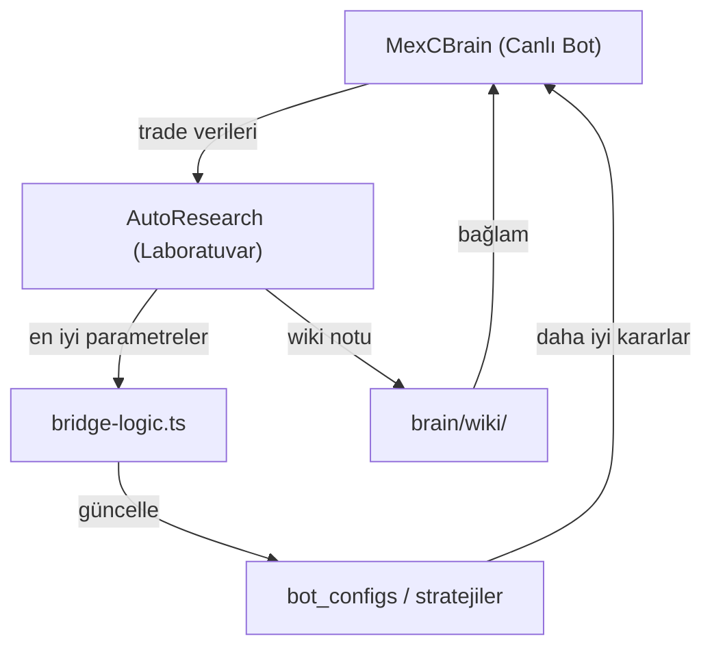

# AutoResearch Döngüsü

AutoResearch, MexCBrain'in **otonom strateji geliştirme** ve **model eğitimi** altyapısıdır.

## Felsefe

## Bileşenler

| Bileşen | Konum | Görev |
|---------|-------|-------|
| `train.py` | `Desktop/AutoResearch/` | NanoGPT model eğitimi |
| `prepare.py` | `Desktop/AutoResearch/` | Veri ön işleme |
| `program.md` | `Desktop/AutoResearch/` | RTX 3080 konfigürasyonu |
| `bridge-logic.ts` | `_tools/system/` | Sonuç aktarım köprüsü |
| `autoResearch.ts` | `_tools/system/` | Parametre arama motoru |

## Token Tasarrufu Protokolü

1. **Önce Wiki oku** → `00-INDEX.md` ile bağlamı hızla yakala.
2. **Sonra entity sayfasını oku** → Modülün API'sini, sorunlarını ve bağımlılıklarını öğren.
3. **Sadece gerekirse** kaynak kodu oku → Gereksiz `grep` ve `view_file` çağrılarından kaçın.

## İnternet Araştırma Protokolü

- Yeni bir kütüphane veya algoritma keşfedildiğinde `concepts/` altına sayfa ekle.
- Sayfa formatı: Başlık, Özet, Kullanım Örneği, MexCBrain'e Nasıl Uyarlanır.

## İlgili Sayfalar
- [[AutoResearchTrain|Train Engine]]
- [[AutoResearchPrepare|Data Preparation]]
- [[SignalScanner|Sinyal Tarayıcı]]
- [[MatrixV5Engine|Matrix V5 Motoru]]
