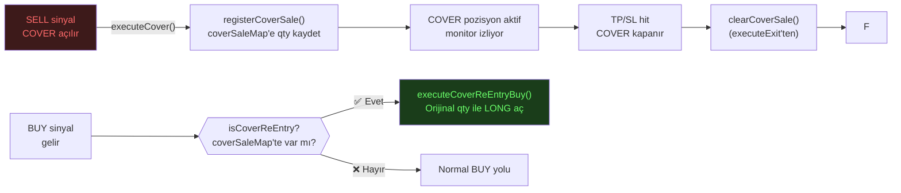

# ♻️ CDT Re-Entry Sistemi

**CDT = Cover-to-Trade**

COVER (short) pozisyon kapatıldığında, aynı miktarda LONG pozisyon açma mekanizması.

---

## Neden Gerekli?

```
Senaryo:
1. BTCUSDT pozisyonum var (100 adet)
2. SELL sinyali → COVER açıldı (100 adet satıldı)
3. BUY sinyali geliyor → ama USDT'm başka yerde olabilir

Problem: 100 adet satıldı, geri almak istiyorum ama
         orijinal miktarı hatırlamamız gerekiyor.

CDT Çözümü: coverSaleMap'e 100 adet kaydet
           → BUY sinyalinde tam miktarla geri al
```

---

## Akış



---

## Uygulama Detayı

```typescript
// Cover satışı kaydedilir:
registerCoverSale(userId, symbol, qty, coverId)

// BUY sinyalinde kontrol:
isCoverReEntry = !hasHolding && !isReEntry && signalType === "BUY" 
                 && hasCoverSale(userId, symbolKey)
coverReEntryQty = getCoverSaleRecord(userId, symbolKey)?.qty || 0

// CDT Buy:
executeCoverReEntryBuy(symbol, botConfig, userId, mode, timeframe, signal, coverQty)
  → handleSmartTrade({
      mode: "TRADE",
      amount: coverQty.toFixed(8),  // Orijinal qty
      buyType: "MARKET",
      useExisting: false,
      ...
    })

// COVER kapanınca temizle:
clearCoverSale(userId, symbol)  // executeExit(COVER) içinden
```

---

## Kısıtlamalar

> [!WARNING]
> `coverSaleMap` **in-memory** — sunucu yeniden başlatılırsa CDT hafızası sıfırlanır!
> (pilotReEntryMap DB'den yükleniyor, coverSaleMap yüklenmiyor)

---

## Normal Re-Entry ile Farkı

| Özellik | CDT Re-Entry | Normal Re-Entry |
|---|---|---|
| **Tetik** | COVER satışı | TRADE satışı |
| **Kaynak** | Token miktarı (qty) | USDT miktarı |
| **Kalıcılık** | In-memory | DB + memory |
| **Harita** | `coverSaleMap` | `pilotReEntryMap` |

---

## Bağlantılar

- **Akış:** [[flows/02-pilot-flow|Pilot Akışı]]
- **Modül:** [[entities/PilotExecutor|PilotExecutor]]
- **İlgili:** [[concepts/ReEntrySystem|Re-Entry Sistemi]] · [[concepts/Matrix-Flip|Matrix Flip]]
