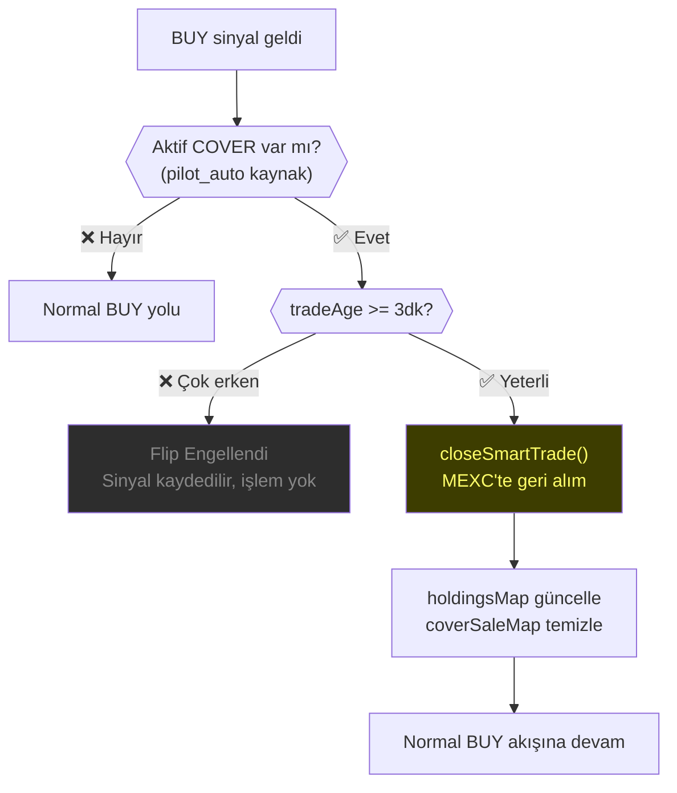

# ↩️ Matrix Flip — Otomatik Yön Değiştirme

**Matrix Mode** (hedge değil) için geçerli: Aktif bir pozisyon varken ters sinyal geldiğinde, mevcut pozisyon kapatılır ve yeni yönde pozisyon açılır.

---

## Senaryo

```
1. BTCUSDT için aktif COVER (short) işlemi var
2. BUY sinyali geldi
3. Matrix Flip tetiklenir:
   → COVER kapatılır (geri alım yapılır)
   → TRADE açılır (long)
```

---

## Guard: Minimum Yaş Kontrolü

```typescript
const MIN_FLIP_AGE_MS = 3 * 60 * 1000; // 3 dakika

// Yeni pozisyon çok kısa süre içinde ters sinyal yerse
// (anlık dalgalanma) flip yapılmaz
if (tradeAge < MIN_FLIP_AGE_MS) {
  // "Matrix Flip çok erken (Xs < 180s)" → veto
  return;
}
```

---

## Akış



---

## closeSmartTrade()

```typescript
static async closeSmartTrade(record, userId, mode) {
  const currentPrice = await getPrice(symbol);
  const qty = parseFloat(record.qty);
  
  if (qty <= 0) {
    // Ghost order — sadece DB'de kapat
    UPDATE orders SET status='CLOSED', meta.exitReason='ZERO_QTY_GHOST_ORDER'
    return;
  }
  
  await executeExit(record, currentPrice, "MATRIX_FLIP_EXIT", meta, qty);
}
```

---

## Sadece Manuel Kaynaklı COVER'lara Dokunulmaz

```
source === "pilot_auto" → Flip yapılabilir
source === "manual"     → Flip yapılmaz

"Kullanıcının el ile açtığı pozisyona AI ellenmez"
```

---

## HoldingsMap Güncellemesi

```typescript
// COVER kapatıldı → asset geri geldi
const flipQty = Number(sellTradeForSymbol.qty || 0);
if (flipQty > 0) {
  holdingsMap.set(sym, { free: flipQty, locked: 0 });
}
// Artık hasHolding=true → BUY yolu farklı bir yolu izleyecek
```

---

## Bağlantılar

- **Akış:** [[flows/02-pilot-flow|Pilot Akışı]] · [[flows/05-exit-flow|Exit Akışı]]
- **Modül:** [[entities/PilotExecutor|PilotExecutor]]
- **İlgili:** [[concepts/CDT-ReEntry|CDT Re-Entry]] · [[concepts/PilotModes|Pilot Modları]]
