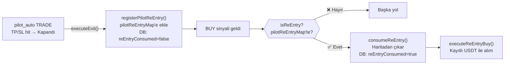

# ♻️ Re-Entry Sistemi — Akıllı Geri Alım

---

## Neden?

```
Pilot bir pozisyonu sattı → USDT'ye dönüştürdü
→ Aynı asset için BUY sinyali geldi
→ Orijinal USDT miktarıyla geri alım yap
→ "Hiç satmamış gibi" aynı pozisyon büyüklüğünü koru
```

---

## Yaşam Döngüsü



---

## DB Kalıcılığı (Restart-Safe)

```sql
-- Her restart sonrası DB'den yüklenir:
SELECT o.symbol, o.meta
FROM orders o
WHERE o.status = 'CLOSED'
  AND o.side = 'BUY'
  AND o.meta->>'source' = 'pilot_auto'
  AND o.meta->>'tradeState' = 'TRADE_COMPLETED'
  AND o.meta->>'reEntryConsumed' IS NULL
  AND NOT EXISTS (
    -- Aktif işlem varsa zaten re-entry yapılmış
    SELECT 1 FROM orders o2
    WHERE o2.symbol = o.symbol 
      AND o2.status IN ('FILLED', 'PENDING')
      AND o2.meta->>'smartTrade' = 'true'
  )
```

---

## Throttle

```typescript
// DB'ye her 60 saniyede bir yükleme yapılır
if (initializedUsers.has(userId) && (now - lastLoad < 60000)) return;
```

---

## Minimum Miktar

```
usdtProceeds < $5 → Re-entry ATLANDI
  (Min $5 MEXC limiti için)
```

---

## consumeReEntry() — Çift Harcama Koruması

```typescript
// 1. In-memory haritadan sil
userMap.delete(cleanSym);

// 2. DB'de işaretle
UPDATE orders SET meta = meta || '{"reEntryConsumed": true}'
WHERE ... ORDER BY updated_at DESC LIMIT 1
// Sadece en son kaydı işaretle → güvenli
```

---

## CDT ile Karşılaştırma

| | Re-Entry | CDT Re-Entry |
|---|---|---|
| **Tetik** | TRADE (LONG) satışı | COVER (SHORT) satışı |
| **Para birimi** | USDT | Token miktarı |
| **Kalıcılık** | DB (restart-safe) | In-memory (sıfırlanır) |
| **Harita** | `pilotReEntryMap` | `coverSaleMap` |

---

## Bağlantılar

- **Akış:** [[flows/02-pilot-flow|Pilot Akışı]] · [[flows/05-exit-flow|Exit Akışı]]
- **Modül:** [[entities/PilotExecutor|PilotExecutor]]
- **İlgili:** [[concepts/CDT-ReEntry|CDT Re-Entry Sistemi]]
