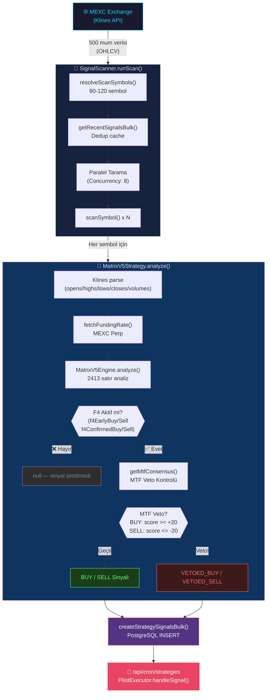

# 🌊 Sinyal Akışı — MEXC'ten Signal DB'ye

Bu sayfa, bir trade sinyalinin nasıl doğduğunu anlatan ilk aşamayı belgeler.
Bir sonraki aşama: [[02-pilot-flow|Pilot Akışı →]]

---

## Tam Akış Diyagramı



---

## 1. MEXC Veri Kaynağı

**Kaynak:** [[entities/MexcWrapper|MexcWrapper]] → `src/lib/mexc.ts`

```
fetchKlines(symbol, timeframe, 500)
→ [time, open, high, low, close, volume, ...][]
```

- Her sembol için **500 mum** çekilir
- Minimum gereksinim: **200 mum** (daha azı → `null` döner)
- Timeframe: `1m`, `5m`, `15m`, `1h`, `4h`, `1d`

---

## 2. SignalScanner — Paralel Tarama

**Kaynak:** [[entities/SignalScanner|SignalScanner]] → `src/services/SignalScanner.ts`

### resolveScanSymbols()

Hangi sembollerin taranacağını belirler:

| Durum | Sonuç |
|---|---|
| `pilot_only_holdings = true` | Holdings + Top 20 asset (max 80 sembol) |
| `pilot_only_holdings = false` | Holdings + Top 60 asset + defaults (max 120 sembol) |
| Test modu | Aktif orders + simülatör bakiyeleri |
| Production modu | Gerçek MEXC cüzdanı |

### Dedup Mekanizması

```typescript
const DEDUP_WINDOW_MS = 5 * 60 * 1000; // 5 dakika
// Aynı sinyal 5 dakika içinde tekrar üretilmez
getRecentSignalsBulk(userId, symbols, DEDUP_WINDOW_MS, mode)
```

### Paralel Tarama

```typescript
const CONCURRENCY = 8;
// 8'li chunk'lar halinde Promise.allSettled() ile paralel
```

---

## 3. MatrixV5Engine — Analiz Kalbi

**Kaynak:** [[entities/MatrixV5Engine|MatrixV5Engine]] → `src/lib/matrix-v5-engine.ts` (2413 satır)

### Hesaplanan Göstergeler

```
F4 Momentum (LinReg tabanlı, 6x EMA smoothing)
├── F4 Power (ATR normalized, [-100, +100])
├── F4 PowerLoss (momentum kaybı %)
├── F4 EarlyBuy / EarlySell (ön sinyal)
└── F4 ConfirmedBuy / ConfirmedSell (onaylı sinyal)

6-Kategori Confluence Engine
├── Tech (RSI, MACD, SuperTrend, WaveTrend) — Ağırlık: %30
├── Momentum (StochRSI, ADX, slope) — Ağırlık: %15
├── Volume (Whale, OBV, VPA, ADM) — Ağırlık: %20
├── Trend (EMA Ribbon, Ichimoku, Heikin-Ashi) — Ağırlık: %15
├── Market (Funding Rate, Market Regime, SMC) — Ağırlık: %15
└── Timing (VIX Fix, Fibo, Liquidity) — Ağırlık: %5

GIGA MASTER AI Score (0-100)
├── whaleConfirmed (+15 maks)
├── regimeAlignment (+10 maks)
├── volumePower (+15 maks)
├── trendAlignment (+10 maks)
├── mtfConsensus (+15 maks)
├── momentumAccel (+15 maks)
├── volatilityRegime (+10 maks)
└── zScore (+10 maks)

Sinyal: F4 aktifse BUY/SELL üretir
F4 AKTİF = f4EarlyBuy OR f4ConfirmedBuy OR f4EarlySell OR f4ConfirmedSell
```

> [!IMPORTANT]
> **F4 Mandate:** F4 aktif değilse hiçbir sinyal üretilmez — ne kadar yüksek AI skoru olursa olsun.

---

## 4. MTF Veto Sistemi

**Kaynak:** [[entities/MtfEngine|MtfEngine]] → `src/lib/mtf-engine.ts`

```
getMtfConsensus(symbol, currentTimeframe, engineBullCount)
→ { mtfScore: [-100, +100], verdictText, nearestScore }

Eşikler:
BUY onayı:  mtfScore >= +20
SELL onayı: mtfScore <= -20

NEAREST TF GUARD:
  BUY + nearestScore < -20  → VETO
  SELL + nearestScore > +20 → VETO
```

> [!WARNING]
> MTF Veto, harika bir sinyali bile veto edebilir. Bu niyetli bir tasarım — yanlış yönde işlem açmaktansa hiç açmamak tercih edilir.

---

## 5. Sinyal Kaydı — PostgreSQL

```typescript
createStrategySignalsBulk(allSignalsToInsert, userId)
// strategy_signals tablosuna toplu INSERT

Signal Tipleri:
BUY             → Onaylı long sinyali
SELL            → Onaylı short sinyali  
SCANNER_BUY     → Tarayıcı buldu, yürütme onayı bekleniyor
VETOED_BUY      → MTF tarafından veto edildi
VETOED_SELL     → MTF tarafından veto edildi
WHALE           → Balina hareketi tespit edildi
INFO            → Bilgi amaçlı kayıt
```

---

## Bağlantılar

- **Bir sonraki aşama:** [[02-pilot-flow|02 — Pilot Akışı]]
- **Alt bileşenler:** [[entities/MatrixV5Engine|MatrixV5Engine]] · [[entities/SignalScanner|SignalScanner]] · [[entities/MtfEngine|MtfEngine]]
- **Kavramlar:** [[concepts/MTF-Consensus|MTF Consensus]] · [[concepts/AiScore|AI Score]] · [[concepts/Confluence|Confluence Engine]]
