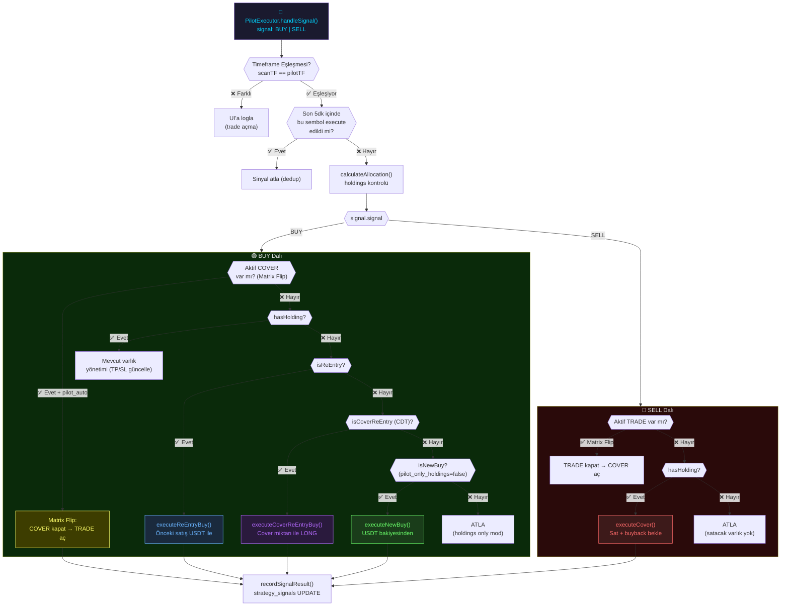

# ✈️ Pilot Akışı — Sinyal Kararından SmartTrade'e

Bu sayfa, bir sinyalin `PilotExecutor` tarafından nasıl işlendiğini belgeler.
**← Öncesi:** [[01-signal-flow|Sinyal Akışı]] | **Sonrası →** [[03-execution-flow|Execution Akışı]]

---

## Ana Karar Diyagramı



---

## Pilot Modları

**Kaynak:** [[entities/PilotExecutor|PilotExecutor]] → `botConfig.pilot_mode`

| Mod | Kural |
|---|---|
| `matrix` | Sembol bazlı — her sembol için max 1 LONG, max 1 SHORT |
| `hedge` | Global — tüm sembollerde max 1 LONG, max 1 SHORT |

---

## 5 Execution Yolu (BUY için)

### Yol 1: executeNewBuy()
```
Koşul: hasHolding=false, isReEntry=false, isCoverReEntry=false,
        pilot_only_holdings=false
Kaynak: USDT bakiyesi × pilot_trade_allocation%
Max: $100,000 güvenlik sınırı
```
**Kaynak:** [[entities/PilotExecutor#executeNewBuy|PilotExecutor.executeNewBuy()]]

### Yol 2: executeReEntryBuy()
```
Koşul: hasHolding=false, önceki pilot_auto TRADE satışı var
Kaynak: pilotReEntryMap → önceki satıştan gelen USDT
Not: DB'den yüklenir (restart sonrası da çalışır)
```
**Kavram:** [[concepts/ReEntrySystem|Re-Entry Sistemi]]

### Yol 3: executeCoverReEntryBuy() — CDT
```
Koşul: hasHolding=false, önceki COVER satışı var (coverSaleMap)
Kaynak: coverSaleMap → satılan token miktarı
Süreç: COVER sat → BUY sinyalinde aynı miktarı geri al
```
**Kavram:** [[concepts/CDT-ReEntry|CDT Re-Entry Sistemi]]

### Yol 4: Mevcut Varlık Yönetimi
```
Koşul: hasHolding=true, BUY sinyali
Action: Mevcut pozisyon için SmartTrade güncelle (TP/SL revize)
targetQty = totalQty (tüm bakiye yönetimi)
```

### Yol 5: Matrix Flip (BUY + Aktif COVER)
```
Koşul: Aktif COVER işlemi var (pilot_auto kaynaklı)
       Trade yaşı >= 3 dakika (MIN_FLIP_AGE_MS)
Action:
  1. COVER'ı closeSmartTrade() ile kapat
  2. holdingsMap güncelle
  3. coverSaleMap temizle
  4. Normal BUY akışına devam
```
**Kavram:** [[concepts/Matrix-Flip|Matrix Flip]]

---

## validatePilotTargets() — TP/SL Kontrolü

Her execution yolundan önce çalışır:

```
TP/SL Validasyon Kuralları:
✅ Long: TP > giriş fiyatı (kullanıcı eşiğinden yukarı)
✅ Long: SL < giriş fiyatı (kullanıcı eşiğinden aşağı)
✅ Short: TP < giriş fiyatı (kullanıcı eşiğinden aşağı)
✅ Short: SL > giriş fiyatı (kullanıcı eşiğinin üstünde)
✅ Risk/Reward: TP mesafesi >= SL mesafesi × 1.5
✅ Minimum SL: giriş fiyatından en az %0.3 uzakta
```

---

## handleSignal() → recordSignalResult()

Her sinyal (execute edilse de edilmese de) DB'ye yazılır:

```typescript
createStrategySignal({
  executed: boolean,        // İşlem açıldı mı?
  veto_reason: string,      // Neden açılmadı?
  execution_result: {...},  // Sonuç detayları
  trading_mode: mode,       // test | production
})
```

---

## Re-Entry Bellek Sistemi

```
pilotReEntryMap: Map<userId, Map<symbol, ReEntryRecord>>
├── DB'den yüklenir (restart-safe, 60s throttle)
├── consumeReEntry() → DB'de reEntryConsumed = true işaretler
└── registerPilotReEntry() → executeExit()'ten çağrılır

coverSaleMap: Map<userId, Map<symbol, CoverSaleRecord>>
├── In-memory (restart'ta sıfırlanır)
├── registerCoverSale() → executeCover()'dan çağrılır
└── clearCoverSale() → executeExit(COVER)'dan çağrılır
```

---

## Bağlantılar

- **Önceki aşama:** [[01-signal-flow|Sinyal Akışı]]
- **Sonraki aşama:** [[03-execution-flow|Execution Akışı]]
- **Modül:** [[entities/PilotExecutor|PilotExecutor]]
- **Kavramlar:** [[concepts/CDT-ReEntry|CDT Re-Entry]] · [[concepts/Matrix-Flip|Matrix Flip]] · [[concepts/PilotModes|Pilot Modları]] · [[concepts/ReEntrySystem|Re-Entry Sistemi]]
