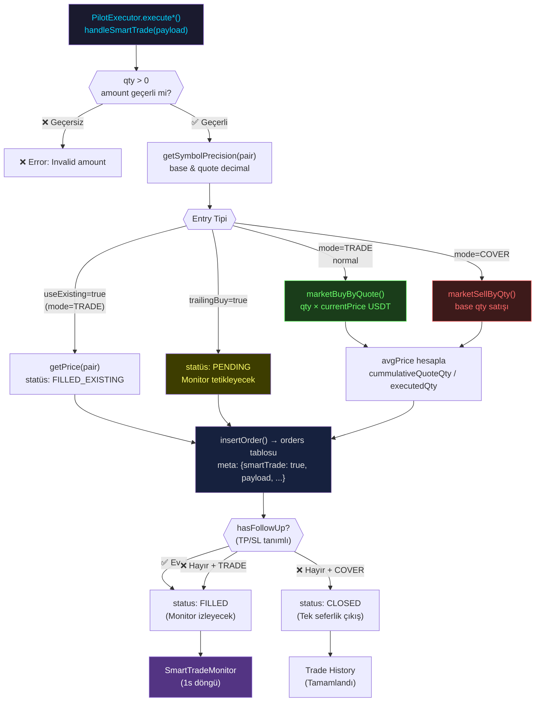

# ⚡ Execution Akışı — SmartTrade Entry ve DB Kaydı

Bu sayfa, bir SmartTrade'in nasıl açıldığını belgeler.
**← Öncesi:** [[02-pilot-flow|Pilot Akışı]] | **Sonrası →** [[04-monitor-flow|Monitor Akışı]]

---

## Akış Diyagramı



---

## handleSmartTrade() — SmartTrade Ana Handler

**Kaynak:** [[entities/SmartTrade|SmartTrade]] → `src/lib/smart-trade.ts`

### SmartTradePayload Yapısı

```typescript
interface SmartTradePayload {
  mode: "TRADE" | "COVER";    // Long veya Short
  symbol: string;              // Örn: "BTCUSDT"
  amount: string;              // Base quantity
  buyPrice: string;            // Hedef giriş fiyatı
  buyType: string;             // "MARKET"
  useExisting?: boolean;       // Varlık zaten mevcut mu?
  takeProfit?: {
    price: string;             // TP fiyatı
    targets?: [{price, volume}]; // Split TP hedefleri
    isSplit?: boolean;         // Kademeli TP
    trailing?: boolean;        // Trailing TP aktif mi?
    deviation?: number;        // TTP geri çekilme %
  };
  stopLoss?: {
    price: string;             // SL fiyatı
    trailing?: boolean;        // Trailing SL aktif mi?
    deviation?: number;        // TSL takip mesafesi %
    timeout?: boolean;         // SL zamanlayıcı
    timeoutSeconds?: number;   // Zamanlayıcı süresi
    breakeven?: boolean;       // TP1 hit → SL giriş fiyatına taşı
  };
  trailingBuy?: boolean;       // Trailing entry
  trailingBuyDev?: number;     // Trailing entry sapma %
  source?: string;             // "pilot_auto" | "manual"
  aiScore?: number;            // AI güven skoru
  mtfVerdict?: string;         // MTF verdict metni
}
```

---

## Entry Senaryoları

### Senaryo A: TRADE (Normal Market Buy)

```
1. getPrice(pair) → currentPrice
2. quoteAmt = qty × currentPrice (USDT)
3. SANITY CAP: quoteAmt > $100,000 → $100,000'e bound
4. marketBuyByQuote(userId, pair, quoteStr) → MEXC API
5. avgPrice = cummulativeQuoteQty / executedQty
   (Fallback: price field veya ticker)
6. qty = executedQty (MEXC'ten gerçek değer)
```

### Senaryo B: TRADE (useExisting)

```
1. Varlık zaten cüzdanda, MEXC'te order açılmaz
2. avgPrice = getPrice(pair) (anlık fiyat)
3. orderId = "EXISTING_ASSET_" + Date.now()
4. status = FILLED (hemen monitore geçer)
```

### Senaryo C: Trailing Buy (Pending Entry)

```
1. MEXC'te order açılmaz
2. status = PENDING
3. orderId = "PENDING_ENTRY_" + Date.now()
4. SmartTradeMonitor.handlePendingTrade() tetikler
   (Fiyat trailing target'a gelince gerçek entry)
```

### Senaryo D: COVER (Market Sell)

```
1. qty = base quantity (satılacak token)
2. marketSellByQty(userId, pair, qtyStr) → MEXC API
3. avgPrice = cummulativeQuoteQty / executedQty
4. TP/SL varsa → status=FILLED, monitor izler
5. TP/SL yoksa → status=CLOSED (tek seferlik)
```

---

## DB Kaydı — orders Tablosu

```typescript
insertOrder({
  user_id,
  mexc_order_id,          // MEXC'ten gelen order ID
  symbol,                  // "BTCUSDT"
  side: "BUY" | "SELL",
  type: "MARKET",
  qty: executedQty,
  quote: cummulativeQuoteQty,
  price: avgPrice,
  status: "FILLED" | "PENDING" | "CLOSED",
  meta: {
    smartTrade: true,       // monitor bu flag'e bakıyor
    payload,                // Tam SmartTradePayload
    mode: "TRADE" | "COVER",
    tradeState,             // TRADE_ACTIVE | COVER_SOLD
    activeTakeProfit,
    activeStopLoss,
    tslActivated,           // COVER için baştan true
    highestPrice: avgPrice, // TSL takibi için
    lowestPrice: avgPrice,
    source,                 // "pilot_auto" | "manual"
    aiScore,
    mtfVerdict,
    filledAt: Date.now(),   // SL buffer için kritik
    initialQty,
    activityLog: [...]
  }
})
```

---

## executeEntry() — Monitor Tetiklenen Entry

**Kaynak:** [[entities/SmartTradeExecution|SmartTradeExecution]] → `src/lib/smart-trade-execution.ts`

PENDING durumundaki trade monitor tarafından tetiklenince çalışır:

```
1. determineExecutionStrategy() → order tipi kararı
2. BUY: marketBuyByQuote() / SELL: marketSellByQty()
3. Trailing Buy düzeltmesi:
   avgPrice ≠ originalBuyPrice → SL ve TP yeniden hesap
   (aynı % mesafeyi koruyarak)
4. UPDATE orders SET status='FILLED', price=avgPrice
```

---

## Trailing Buy SL/TP Düzeltme Mantığı

```
Örnek:
  originalBuyPrice = 100
  originalSL = 97 (-%3)
  Gerçek entry = 95

  slDistRatio = |100 - 97| / 100 = 0.03
  newSL = 95 × (1 - 0.03) = 92.15

  → SL hep aynı % uzaklıkta, fiyata göre ayarlanır
```

---

## Bağlantılar

- **Önceki aşama:** [[02-pilot-flow|Pilot Akışı]]
- **Sonraki aşama:** [[04-monitor-flow|Monitor Akışı]]
- **Modüller:** [[entities/SmartTrade|SmartTrade]] · [[entities/SmartTradeExecution|SmartTradeExecution]] · [[entities/MexcWrapper|MexcWrapper]]
