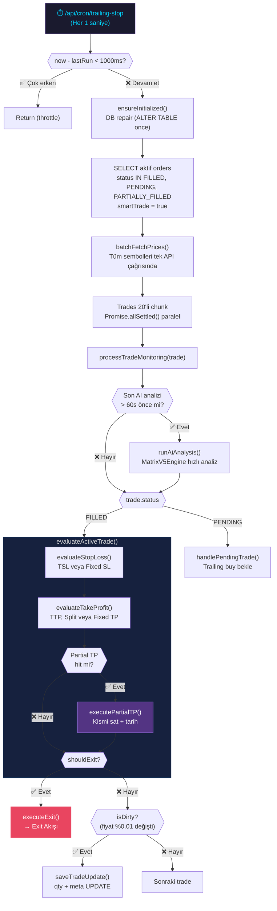

# 🔄 Monitor Akışı — 1 Saniyelik İzleme Döngüsü

Bu sayfa, açık işlemlerin nasıl izlendiğini, TSL/TTP mantığının nasıl çalıştığını belgeler.
**← Öncesi:** [[03-execution-flow|Execution Akışı]] | **Sonrası →** [[05-exit-flow|Exit Akışı]]

---

## Monitor Döngüsü Diyagramı



---

## Temel Sabitler

```typescript
MONITOR_INTERVAL = 1000ms      // Döngü frekansı: 1s
AI_ANALYSIS_INTERVAL = 60000ms // AI yenileme: 60s
CONCURRENCY_LIMIT = 20         // Paralel trade işleme
```

---

## runAiAnalysis() — Anlık Trend Takibi

Her 60 saniyede bir aktif trade için hızlı analiz:

```typescript
MatrixV5Engine.analyze(klines, timeframe)
→ {
  aiScore,    // Güncel güven skoru
  aiLogs: [
    "Trend: BULLISH",
    "Regime: ACCELERATING_TREND",
    "Decision: GO_LONG"
  ]
}
// meta.lastAiScore olarak DB'ye kaydedilir
```

---

## evaluateStopLoss() — Stop Loss Değerlendirme

**Kaynak:** [[concepts/TSL-TTP-Logic|TSL/TTP Mantığı]]

### Trailing SL (TSL) Yolu

```
Koşul: payload.stopLoss.trailing === true (strict check)

İlk SL mesafesi: |entryPrice - initialSL| / entryPrice
TP hitinden önce: distRatio = initialSlDistRatio (tam mesafe)
TP hitinden sonra: distRatio = deviation / 100 (sıkılaştırılmış)

LONG için:
  trailSL = calculateTrailingExitTarget(highest, distRatio)
  finalSL = max(trailSL, prevSL)  ← yukarı taşır, aşağı inmez

COVER için:
  trailSL = calculateTrailingExitTarget(lowest, distRatio)
  finalSL = min(trailSL, prevSL)  ← aşağı taşır, yukarı çıkmaz

Minimum mesafe: %0.1 (çok sıkı SL'den koruma)
```

> [!WARNING]
> **Kritik Düzeltme (FIX-B):** TSL artık TP hit'ini beklemeden çalışır. Eski sistemde TSL yalnızca TP hit sonrası aktifleşiyordu — bu %86 zarar oranının başlıca nedenliydi.

### Volatility Buffer (30s Warmup)

```
İşlem açıldıktan sonraki 30 saniye içinde:
SL tetiklenebilir ama piyasa dalgalanması ise:
  currentDrop < slThreshold × 1.2 → SL ATLANDI

Gerçek kırılım (1.2x eşiğin ötesinde) → SL normal işleniyor
```

### SL Timeout

```
sl.timeout = true ve sl.timeoutSeconds = N:
1. SL hit → slTimeoutStart = Date.now() (kaydet, çıkma)
2. N saniye boyunca her döngüde kontrol
3. N saniye geçtiyse → EXIT
4. Fiyat SL'nin üstüne çıktıysa → slTimeoutStart = null (sıfırla)
```

---

## evaluateTakeProfit() — Take Profit Değerlendirme

### Trailing TP (TTP)

```
Koşul: takeProfit.trailing === true ve son hedefte

Phase 1 — TP Aktivasyon:
  currentPrice >= tpPrice (LONG) → tpTriggered = true
  meta.ttpActivationPrice kaydedilir

Phase 2 — TTP Takibi:
  trailExit = calculateTrailingExitTarget(highest, deviation%)
  finalTp = max(trailExit, prevTp)  ← yukarı taşır

Phase 3 — TTP Exit:
  currentPrice <= finalTp → EXIT
```

### Split TP (Kademeli)

```
targets: [{price: "100", volume: 50}, {price: "110", volume: 50}]

Her hedef kontrol edilir:
  priceCrossedTp → executePartialTP()
  Satılan qty kadar trade qty azalır
  filledTargets[] listesine hedef index'i eklenir
  
Son hedefe gelince: TTP aktif (eğer trailing=true)
```

### Fixed TP (Sabit)

```
currentPrice >= tpPrice (LONG):
mode=COVER değilse → tam EXIT
```

---

## handlePendingTrade() — Trailing Buy Bekleme

PENDING statüsündeki trade'ler için:

```
Fiyat trailing target'a gelince:
→ executeEntry() çağrılır
→ status: FILLED

Trailing Buy Target Hesabı:
calculateTrailingBuyTarget(payload, currentPrice)
```

---

## saveTradeUpdate() vs executeExit()

```
isDirty = true ve shouldExit = false:
  PriceChange > 0.01%? → saveTradeUpdate(id, qty, meta)
  (DB baskısını azaltmak için filtreleme)

shouldExit = true:
  → executeExit(trade, currentPrice, reason, meta, qty)
  → Exit Akışı başlar
```

---

## Pilot Kapalı + TP/SL Koruması (FIX-H)

```
pilotEnabled = false:
  Yeni işlem AÇILMAZ (pilot-executor.ts'de engellenir)
  Mevcut işlemlerin TSL/TTP'si ÇALIŞMAYA DEVAM EDER

"Pilot kapalı = sadece yeni işlem yok,
  var olan pozisyonlar korunmaya devam eder"
```

---

## Bağlantılar

- **Önceki aşama:** [[03-execution-flow|Execution Akışı]]
- **Sonraki aşama:** [[05-exit-flow|Exit Akışı]]
- **Modül:** [[entities/SmartTradeMonitor|SmartTradeMonitor]] · [[entities/TradingLogic|TradingLogic]]
- **Kavramlar:** [[concepts/TSL-TTP-Logic|TSL/TTP Mantığı]]
