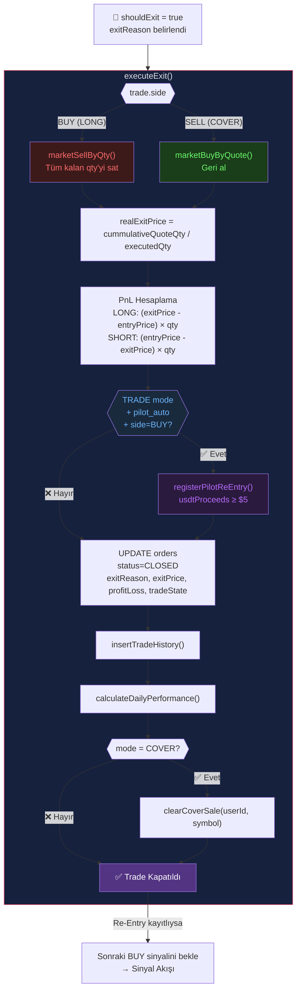

# 🏁 Exit Akışı — Çıkış Sekansları ve Sonrası

Bu sayfa, bir SmartTrade'in nasıl kapandığını, PnL hesaplamasını ve re-entry zincirini belgeler.
**← Öncesi:** [[04-monitor-flow|Monitor Akışı]] | **Döngü başı →** [[01-signal-flow|Sinyal Akışı]]

---

## Exit Diyagramı



---

## Exit Tetikleyicileri

| Tetikleyici | exitReason | Kaynak |
|---|---|---|
| TSL Hit | `Trailing Stop Loss vuruldu (TSL: $X)` | evaluateStopLoss() |
| Fixed SL Hit | `Sabit Stop Loss'a ulaşıldı ($X)` | evaluateStopLoss() |
| TTP Hit | `Trailing TP vuruldu (TTP: $X)` | evaluateTakeProfit() |
| Fixed TP Hit | `TP hedefine ulaşıldı` | evaluateTakeProfit() |
| Matrix Flip | `MATRIX_FLIP_EXIT` | PilotExecutor.closeSmartTrade() |
| Panic Exit | `PANIC_EXIT` | /api/panic |
| SL + Timeout | `Trailing SL + Timeout sonrası kapandı` | evaluateStopLoss() |
| Sıfır Qty | `ZERO_QTY_GHOST_ORDER` | PilotExecutor.closeSmartTrade() |

---

## PnL Hesaplama

```typescript
// LONG (side = BUY):
profitLoss = (realExitPrice - entryPrice) × executedQty
profitLossPercentage = ((realExitPrice - entryPrice) / entryPrice) × 100

// SHORT (side = SELL / COVER):
// Entry: sattık, Exit: geri aldık
profitLoss = (entryPrice - realExitPrice) × executedQty
profitLossPercentage = ((entryPrice - realExitPrice) / entryPrice) × 100
```

---

## Re-Entry Hook — Döngünün Sürekliliği

Exit içinden `registerPilotReEntry()` çağrısı yapılır:

```
Koşul:
  ✅ tradeMode = TRADE (LONG pozisyon)
  ✅ source = pilot_auto
  ✅ side = BUY (alım ile açılan pozisyon)
  ✅ usdtProceeds >= $5

Sonuç:
  pilotReEntryMap[userId][symbol] = {
    lastSaleUsdt: usdtProceeds,
    lastSaleAt: now,
    symbol
  }

→ Bir sonraki BUY sinyalinde executeReEntryBuy() tetiklenir
```

**Kavram:** [[concepts/ReEntrySystem|Re-Entry Sistemi]]

---

## Partial TP Exit — executePartialTP()

Split TP hedeflerinde tam kapatma yerine kısmi satış:

```typescript
executePartialTP(trade, currentPrice, currentQty, exec, meta)

1. BUY ise: marketSellByQty(exec.qty)
   SELL ise: marketBuyByQuote(exec.qty × currentPrice)
2. newQty = currentQty - executed
3. insertTradeHistory(type: "PARTIAL_TP")
4. calculateDailyPerformance()
5. filledTargets[] listesine hedef index ekle
6. → trade devam eder (tam kapatılmaz)
```

---

## insertTradeHistory() — Kalıcı Kayıt

```typescript
{
  user_id,
  order_id,
  symbol,
  side,              // Exit tarafı (LONG exit = SELL)
  type,              // "MARKET" | "PARTIAL_TP"
  qty: executedQty,
  price: realExitPrice,
  quote_qty: realExitPrice × executedQty,
  commission: 0,
  profit_loss,
  profit_loss_percentage,
  created_at: Date.now()
}
```

---

## calculateDailyPerformance()

Her exit sonrası tetiklenir:

```
Günlük:
  - Toplam işlem sayısı
  - Win/Loss oranı
  - Brüt PnL ($ ve %)
  - Best/Worst trade

Portfolio genelinde güncellenir.
```

---

## Panic Exit — /api/panic

**Kaynak:** [[entities/PanicService|PanicService]] → `src/lib/panic-service.ts`

```
Tetikleyici: UI'dan "Panic Exit" butonu

Tüm aktif FILLED/PENDING orders için:
  1. Anlık fiyat al (batchFetchPrices)
  2. executeExit(trade, price, "PANIC_EXIT")
  3. Hepsini aynı anda kapat (Promise.allSettled)

Kullanım: Acil piyasa çıkışı
```

---

## Matrix Flip Exit — closeSmartTrade()

**Kaynak:** [[entities/PilotExecutor|PilotExecutor]]

```
Koşul: Yeni sinyal ters yönde + aktif trade var
       (BUY sinyali → aktif COVER; SELL sinyali → aktif TRADE)

1. executeExit(record, currentPrice, "MATRIX_FLIP_EXIT")
2. Başarısız olursa: DB'de meta.exitError = "FAILED_TO_EXIT_API"
3. Başarılıysa: Yeni yön için yeni SmartTrade açılır
```

**Kavram:** [[concepts/Matrix-Flip|Matrix Flip]]

---

## Trade Yaşam Döngüsü — Tüm Durumlar

```
PENDING → (Trailing buy tetiklendi) → FILLED
FILLED  → (TP/SL hit)               → CLOSED
FILLED  → (Partial TP)              → PARTIALLY_FILLED → CLOSED
FILLED  → (Panic / Flip)            → CLOSED
```

---

## Bağlantılar

- **Önceki aşama:** [[04-monitor-flow|Monitor Akışı]]
- **Döngü başı:** [[01-signal-flow|Sinyal Akışı]] (Re-Entry varsa)
- **Modüller:** [[entities/SmartTradeExecution|SmartTradeExecution]] · [[entities/PilotExecutor|PilotExecutor]] · [[entities/PanicService|PanicService]]
- **Kavramlar:** [[concepts/ReEntrySystem|Re-Entry Sistemi]] · [[concepts/Matrix-Flip|Matrix Flip]] · [[concepts/TSL-TTP-Logic|TSL/TTP Mantığı]]
