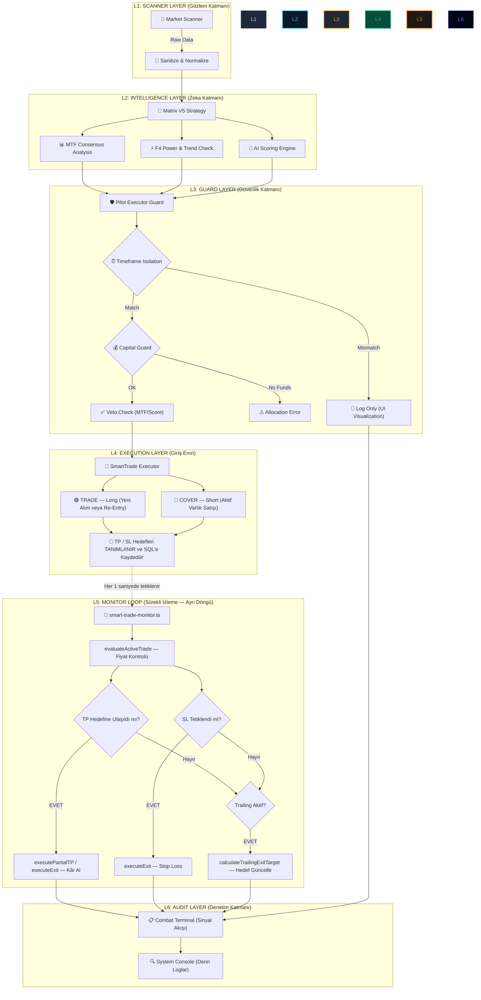

# 🌌 Pilot Pipeline 3D Mimari Analizi

Bu doküman, sistemin **Pilot Pipeline**'ının katmanlı mimarisini ve verinin bir sinyalden işleme nasıl dönüştüğünü 3 boyutlu bir perspektifle açıklar. Sistem, **TRADE (Long)** ve **COVER (Short)** üzerine kuruludur.

## 🏗️ Katmanlı Mimari Şeması (3D Perspective)

> [!NOTE]
> Aşağıdaki şema, sistemin dikey (vertically integrated) yapısını ve verinin derinliğini temsil eder.

---

## 🛠️ Pipeline Derinlik Analizi

### 1. Katman (Gözlem): Veri Toplama

Sistem, MEXC borsasından gelen ham mum (k-line) verilerini anlık olarak çeker. Bu katman, "Gözlem" katmanıdır ve sistemin dünyaya açılan penceresidir.

### 2. Katman (Zeka): Karar Mekanizması

En yoğun işlem bu katmanda gerçekleşir. Sadece tek bir indikatöre değil, **5 farklı zaman diliminin (MTF)** ve **AI Skoru**'nun konfluansına (kesişimine) bakılır.

### 3. Katman (Güvenlik): İzolasyon Muhafızları

- **Timeframe Guard:** İzleme ve Pilot periyotları burada ayrıştırılır.
- **Veto Guard:** MTF skoru veya AI skoru yetersizse sinyal burada **VETO** alır.

### 4. Katman (Giriş Emri): TRADE ve COVER Mimarisi

> [!IMPORTANT]
> Sistem **Long/Short** değil, **TRADE (Long)** ve **COVER (Short)** terminolojisiyle çalışır.

- **🟢 TRADE (Long):** Yeni varlık alımı veya Re-Entry (Geri Alım). TP / SL parametreleri **tanımlanıp** SmartTrade kaydına yazılır. Ancak burada **çalıştırılmaz.**
- **🔴 COVER (Short):** Portföydeki varlığın kısa pozisyona alınması. TP / SL parametreleri yine **tanımlanır, çalıştırılmaz.**

### 5. Katman (Monitor Loop): TP/SL'nin Gerçekten Tetiklendiği Yer

> [!CAUTION]
> TP ve SL **Giriş emri sırasında değil**, `smart-trade-monitor.ts` döngüsünde **her saniye** kontrol edilerek tetiklenir.

- `evaluateTakeProfit()` → Fiyat TP hedefine ulaştıysa → `executePartialTP` veya `executeExit`
- `evaluateStopLoss()` → Fiyat SL hedefine düştüyse → `executeExit`
- `calculateTrailingExitTarget()` → Trailing aktifse hedef dinamik olarak güncellenir.

### 6. Katman (Denetim): CombatLog Görselleştirme

Her işlem, her veto ve her kapanış — başarılı olsun ya da olmasın — `CombatLog`'a yazılır.

---

> [!NOTE]
> **Özet:** Giriş emirleri (L4) sadece karar verir ve kaydeder. TP/SL'nin gerçekleşmesi tamamen bağımsız bir `cron` döngüsünde (L5) yaşar. Bu tasarım, botun aynı anda onlarca işlemi eş zamanlı takip edebilmesini sağlar.
