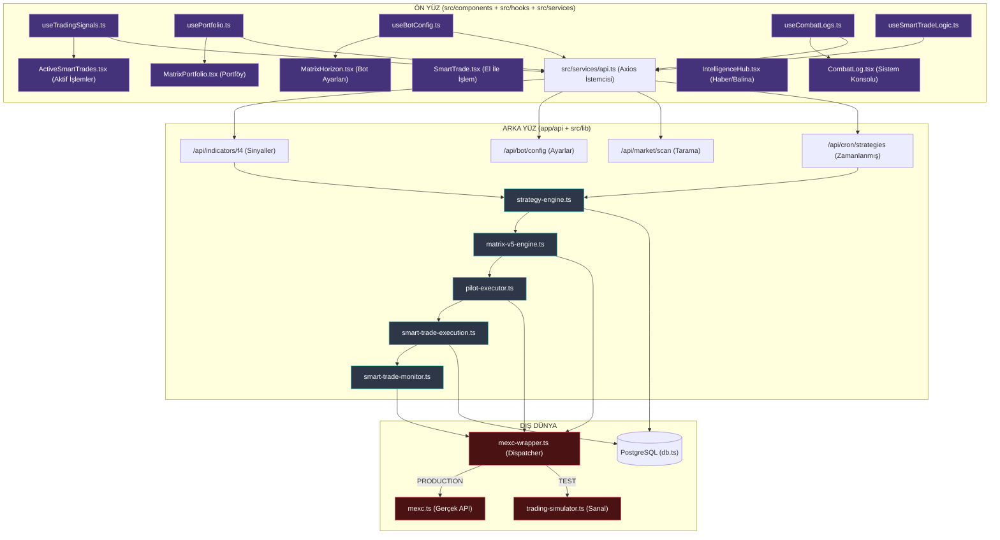
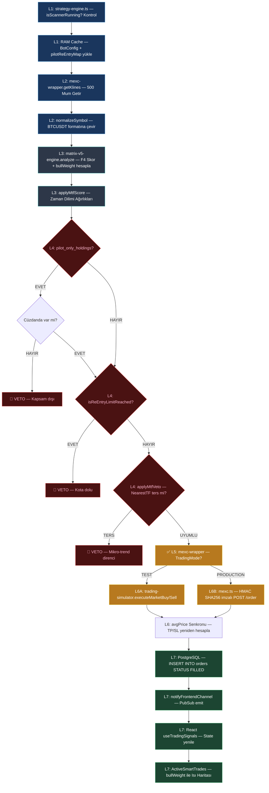
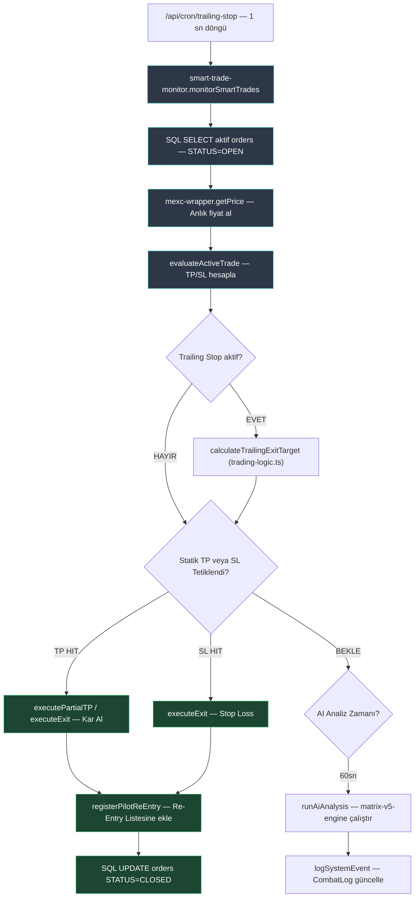
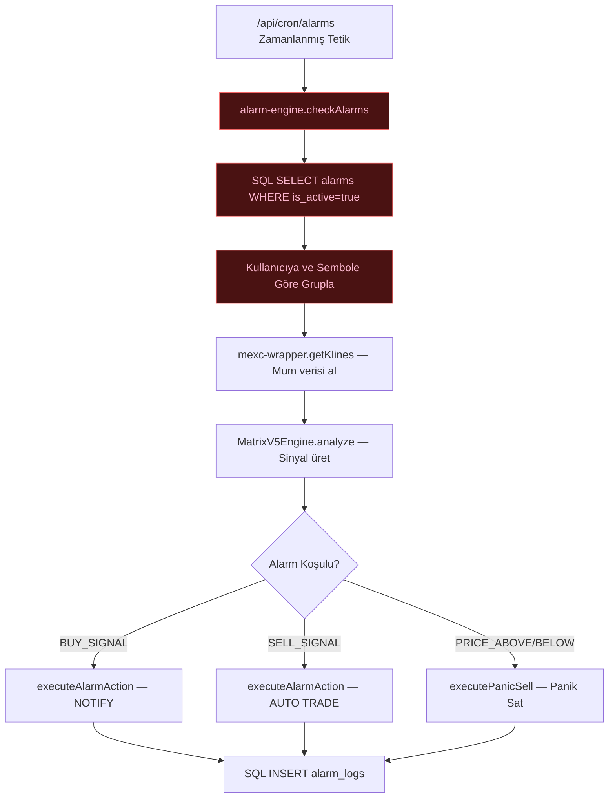
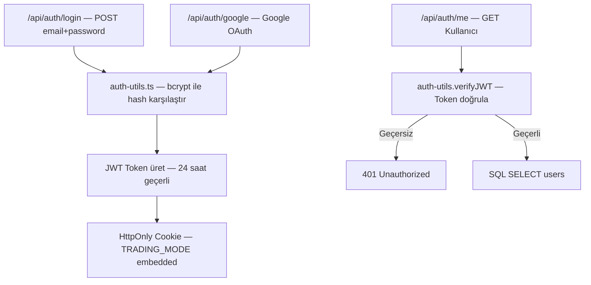
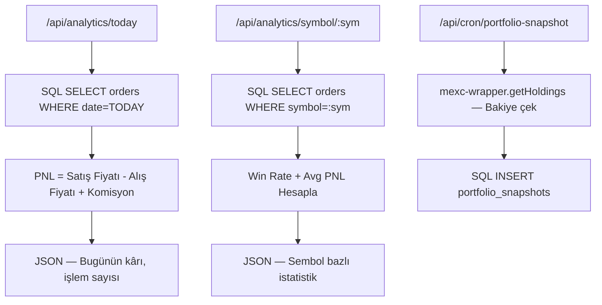
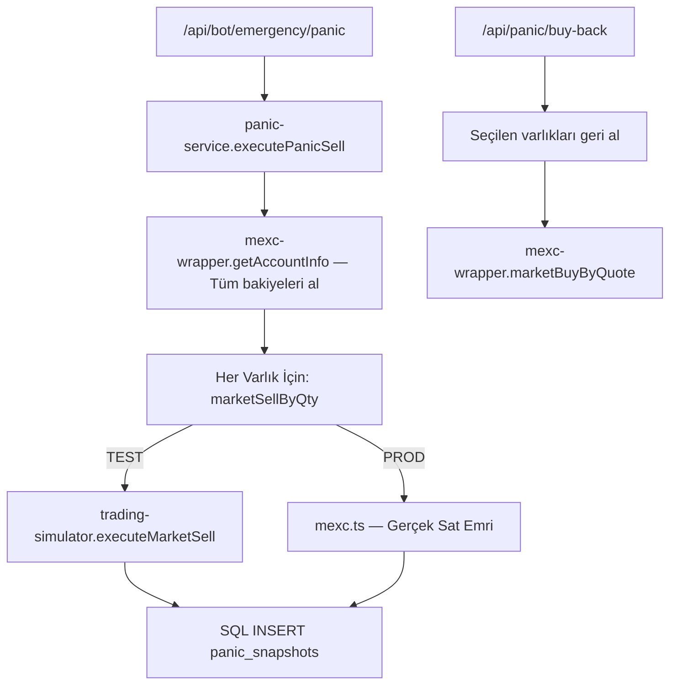

# 🦅 Matrix V5: A'dan Z'ye Nihai Tek Harita — Mutlak Pipeline (v8.0)

> Bu doküman projenin tüm TypeScript ekosistemini kapsar. Her modülün kime bağlandığı, ne iş yaptığı ve import zinciri aşağıda detaylıdır.

---

## 🗺️ Bölüm 1: Global Veri Mimarisi — Katmanlar Arası Akış

---

## ⚙️ Bölüm 2: Otopilot İşlem Hattı — 7 Katman Detayı

---

## 🔁 Bölüm 3: Aktif İşlem Döngüsü (Monitor Pipeline)

---

## 🔔 Bölüm 4: Alarm Motoru ve Bildirim Akışı

---

## 🛡️ Bölüm 5: Güvenlik ve Kimlik Doğrulama (Auth Pipeline)

---

## 📊 Bölüm 6: Analytics ve Performans Akışı

---

## 💣 Bölüm 7: Panik Servis ve Emergency Pipeline

---

## 🧩 Bölüm 8: Tüm Dosya Bağımlılık Tablosu

| Dosya                      | Konumu         | Bağımlı Olduğu                                         | Görevi                            |
| :------------------------- | :------------- | :----------------------------------------------------- | :-------------------------------- |
| `strategy-engine.ts`       | src/lib        | matrix-v5-engine, pilot-executor, db, mexc-wrapper     | Otopilot tarama döngüsü           |
| `matrix-v5-engine.ts`      | src/lib        | indicators, trade-utils                                | F4 + bullWeight AI motoru         |
| `pilot-executor.ts`        | src/lib        | db, mexc-wrapper, trade-utils                          | Veto zinciri + Emir kararı        |
| `smart-trade-monitor.ts`   | src/lib        | mexc-wrapper, smart-trade-execution, trading-logic, db | Aktif işlem takibi                |
| `smart-trade-execution.ts` | src/lib        | mexc-wrapper, db, pilot-executor.registerReEntry       | Emir yürütme (Entry/Exit)         |
| `trading-logic.ts`         | src/lib        | — (Pure Logic)                                         | F4Data tipleri, Trailing hesap    |
| `alarm-engine.ts`          | src/lib        | matrix-v5-engine, mexc-wrapper, panic-service, db      | Alarm kontrol döngüsü             |
| `panic-service.ts`         | src/lib        | mexc-wrapper, db, symbol-utils                         | Tüm portföyü sat                  |
| `mexc-wrapper.ts`          | src/lib        | mexc, trading-simulator, trading-mode                  | Test/Prod yönlendirici            |
| `mexc.ts`                  | src/lib        | — (External API)                                       | MEXC API sürücüsü (HMAC)          |
| `trading-simulator.ts`     | src/lib        | symbol-utils, db                                       | Sanal borsa simülatörü            |
| `trading-mode.ts`          | src/lib        | —                                                      | Test/Prod mod kontrolü            |
| `db.ts`                    | src/lib        | postgres                                               | Tüm SQL sorguları                 |
| `auth-utils.ts`            | src/lib        | db, jwt                                                | Kimlik doğrulama                  |
| `diagnostics.ts`           | src/lib        | db, mexc-wrapper                                       | Bot sağlık raporu                 |
| `trade-utils.ts`           | src/lib        | —                                                      | MTF Verdict, TP/SL yardımcıları   |
| `symbol-utils.ts`          | src/lib        | —                                                      | normalizeSymbol, extractBaseAsset |
| `indicators.ts`            | src/lib        | —                                                      | Teknik İndikatör formülleri       |
| `SignalScanner.ts`         | src/services   | mexc, db, strategies, mexc-wrapper                     | Sinyal tarayıcı sınıfı            |
| `api.ts`                   | src/services   | —                                                      | Frontend Axios istemcisi          |
| `useTradingSignals.ts`     | src/hooks      | api.ts                                                 | F4/MTF verisi için hook           |
| `usePortfolio.ts`          | src/hooks      | api.ts                                                 | Bakiye/Portföy için hook          |
| `useBotConfig.ts`          | src/hooks      | api.ts                                                 | Bot ayarları için hook            |
| `useCombatLogs.ts`         | src/hooks      | api.ts                                                 | Konsol logları için hook          |
| `ActiveSmartTrades.tsx`    | src/components | useTradingSignals, trading-logic                       | Aktif işlem tablosu               |
| `MatrixPortfolio.tsx`      | src/components | usePortfolio, trading-logic                            | Portföy arayüzü                   |
| `MatrixHorizon.tsx`        | src/components | useBotConfig                                           | Bot config paneli                 |
| `CombatLog.tsx`            | src/components | useCombatLogs                                          | Sistem konsolu                    |
| `SmartTrade.tsx`           | src/components | useSmartTradeLogic                                     | Manuel işlem paneli               |
| `IntelligenceHub.tsx`      | src/components | useWhaleRadar, useNewsData                             | Haber ve balina radar             |

---

## 🚥 Bölüm 9: Kritik Güvenlik Kapıları (Guard Rails)

| Kural              | Dosya                      | Tetikleyici                | Sonuç                               |
| :----------------- | :------------------------- | :------------------------- | :---------------------------------- |
| Singleton Tarayıcı | `strategy-engine.ts`       | `isScannerRunning=true`    | Çift tarama önlendi                 |
| Kapsam Filtresi    | `pilot-executor.ts`        | `pilot_only_holdings=true` | Cüzdan dışı sinyal bloklandı        |
| Re-Entry Normalize | `pilot-executor.ts`        | `normalizeSymbol()`        | BTC/USDT ≠ BTCUSDT hatası giderildi |
| MTF Veto           | `pilot-executor.ts`        | `NearestTF < threshold`    | Mikro-trend direnci →İptal          |
| Kota Koruması      | `pilot-executor.ts`        | `reEntryMap.size >= limit` | Kotayı aşan geri alımlar bloklandı  |
| Precision Guard    | `smart-trade-execution.ts` | `floor(qty * 1e8) / 1e8`   | Borsa "invalid qty" hatası önlendi  |
| Test/Prod Emniyet  | `mexc-wrapper.ts`          | `getTradingMode()`         | Gerçek para kazara harcanmadı       |

---

> [!IMPORTANT]
> **Mimari Özet:** Bu projenin tam veri döngüsü şu çizgide ilerler:
> `MEXC Piyasası → mexc-wrapper → matrix-v5-engine → pilot-executor → mexc-wrapper (dispatcher) → mexc.ts VEYA trading-simulator → db → PubSub → React UI`
>
> Projedeki yaklaşık 125 TS/TSX dosyasının %60'ı `src/lib` altındadır ve sistemin tüm zekası bu klasörde yaşar.
