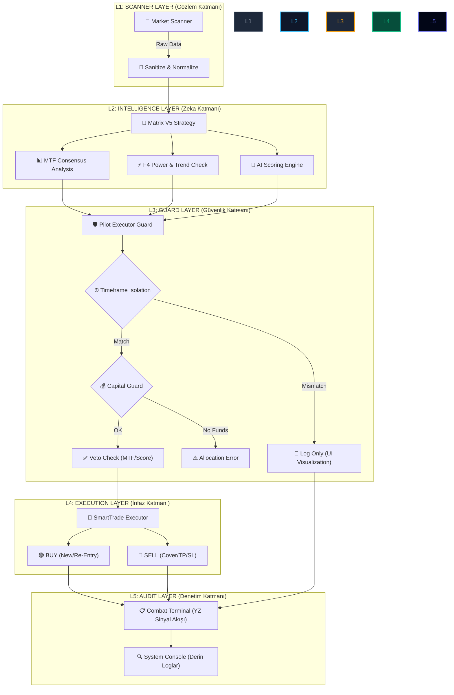

# 🌌 Pilot Pipeline 3D Mimari Analizi

Bu doküman, sistemin "kalbi" olan **Pilot Pipeline**'ın (Otopilot İşlem Hattı) katmanlı mimarisini ve verinin bir sinyalden işleme nasıl dönüştüğünü 3 boyutlu bir perspektifle açıklar.

## 🏗️ Katmanlı Mimari Şeması (3D Perspective)

> [!NOTE]
> Aşağıdaki şema, sistemin dikey (vertically integrated) yapısını ve verinin derinliğini temsil eder.

## 🛠️ Pipeline Derinlik Analizi

### 1. Katman (Gözlem): Veri Toplama

Sistem, MEXC borsasından gelen ham mum (k-line) verilerini anlık olarak çeker. Bu katman, "Gözlem" katmanıdır ve sistemin dünyaya açılan penceresidir.

### 2. Katman (Zeka): Karar Mekanizması

En yoğun işlem bu katmanda gerçekleşir. Sadece tek bir indikatöre değil, **5 farklı zaman diliminin (MTF)** ve **AI Skoru**'nun konfluansına (kesişimine) bakılır. Sistem "akıllı" bir karar vermeden önce veriyi 360 derece analiz eder.

### 3. Katman (Güvenlik): İzolasyon Muhafızları

Burada veriler süzgeçten geçer:

- **Timeframe Guard:** Senin seçtiğin sidebar periyodu ile botun işlem periyodu burada ayrıştırılır. "İzleme" ve "Pilot" bu noktada kollara ayrılır.
- **Veto Guard:** Eğer MTF %65'in altındaysa veya AI skoru yetersizse, sinyal burada "VETO" yer.

### 4. Katman (İnfaz): Emir Pipeline'ı

Tüm onaylar alındıktan sonra, veri bir API isteğine dönüşür. **SmartTrade** motoru devreye girerek TP/SL ayarlarını yapar ve emri borsaya iletir.

### 5. Katman (Denetim): Görselleştirme

Son aşamada, tüm bu karmaşık süreç kullanıcının anlayabileceği "Şahane" sinyal kartlarına (`CombatLog`) dönüştürülür. İşlem başarılı olsa da olmasa da, denetim katmanı her adımı şeffafça loglar.

---

> [!IMPORTANT]
> Sistem şu an **Tam İzolasyon** modundadır. Kullanıcılar arası veri sızıntısı ve periyot karışıklığı bu pipeline sayesinde 0'a indirilmiştir.
